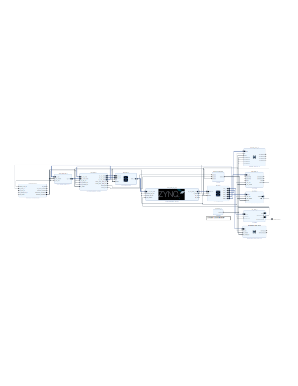

# DMA Demostration
> dict_keys(['axi_gpio_0', 'led_blinker_axion_reg_0', 'axi4lite_slave_0', 'axi_intc_0', 'axi_dma_0', 'axi_timer_0', 'zynq_ultra_ps_e_0'])

```
Pynq-IMPCAS-ZU9/notebooks/custom/dma_timer_regfile/
├── dma.ipynb (dma demostration)
├── dma_timer_regfile.svg
├── dma_timer_regfile.xsa
├── README.md
├── regfile.ipynb (axi4lite slave regfile demostration)
└── timer.ipynb (axi timer and interrupt demostration)
```

## Block Design

<details>



</details>

## References
- https://pynq.readthedocs.io/en/latest/pynq_libraries.html
- https://github.com/cathalmccabe/PYNQ_tutorials/tree/master

### DMA
- https://pynq.readthedocs.io/en/latest/pynq_libraries/dma.html
- https://pynq.readthedocs.io/en/latest/pynq_libraries/allocate.html
- https://discuss.pynq.io/t/tutorial-pynq-dma-part-1-hardware-design/3133
- https://discuss.pynq.io/t/tutorial-pynq-dma-part-2-using-the-dma-from-pynq/3134

### INTC
- https://pynq.readthedocs.io/en/latest/pynq_libraries/interrupt.html
- https://discuss.pynq.io/t/zynq-ps7-interrupts/198/6
- https://www.adiuvoengineering.com/post/microzed-chronicles-pynq-interrupts

